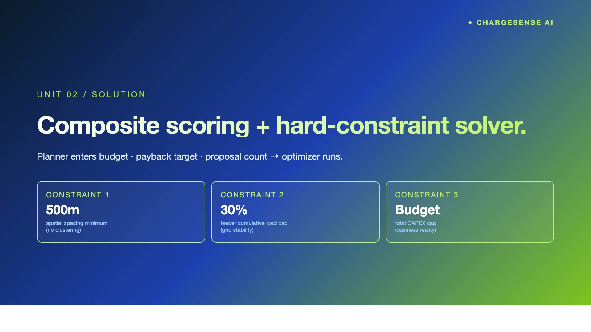
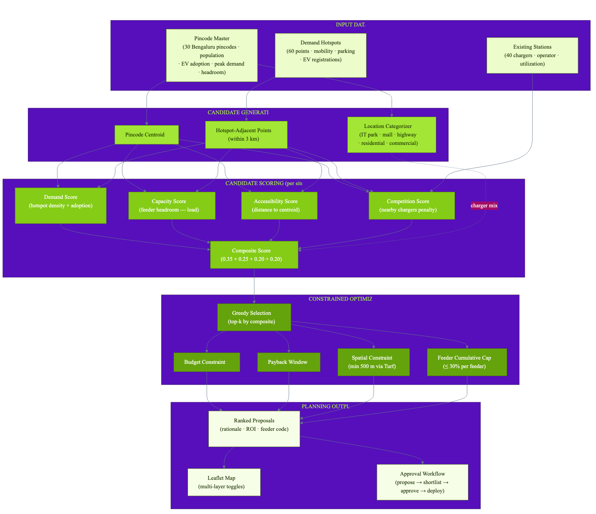

# ChargeSense AI — EV Charging Infrastructure Planning for BESCOM

**Demand-driven, feeder-constrained EV charger siting with explainable ROI projections and a four-state approval workflow.**

BESCOM planners enter a budget, minimum-payback target, and desired proposal count. The system generates candidate sites for every Bengaluru pincode (centroids + hotspot-adjacent points), scores each on a four-component composite (demand 35% + capacity 25% + accessibility 20% + competition 20%), and greedy-selects the best sites subject to three hard constraints: spatial 500m minimum between selected sites, feeder cumulative load ≤ 30% of headroom, and budget. Every proposal ships with a verbatim rationale, a 5-year ROI projection, a feeder-code binding, and a full approval workflow.

> **PanIIT AI for Bharat Hackathon** — Theme 9: AI for EV Charging Optimization & Infrastructure Planning (BESCOM)


## 🎥 Demo Video

[](demo/video/demo.mp4)

> Voiceover by ElevenLabs (Brian, male). Pipeline reproducible — see `demo/video/`.

## Quick Start

```bash
# Install dependencies
npm install

# Generate Prisma client + migrate
npx prisma generate
npx prisma migrate dev --name init

# Seed demo data (29 pincodes · 40 stations · 60 hotspots · 15 proposals)
npm run seed

# Run dev server
npm run dev
# → http://localhost:3000
```

## Architecture



Four stages:

1. **Data Ingestion** — pincode master (population, EV adoption, grid headroom), existing stations, demand hotspots
2. **Candidate Generation** — per pincode: centroid + hotspot-adjacent points (within 3 km), categorized by area type (IT park / mall / highway / residential / etc.)
3. **Scoring** — four-component composite: demand (hotspot density + adoption), capacity (feeder headroom vs. load), accessibility (distance to centroid), competition (nearby chargers penalty)
4. **Constrained Optimization** — greedy top-k with hard constraints: budget, payback window, spatial 500m, cumulative feeder impact ≤ 30%

Every proposal records verbatim rationale, ROI projection (CAPEX, monthly revenue, payback months), and the specific feeder code it loads onto.

## Tech Stack

- **Framework:** Next.js 15 (App Router, TypeScript)
- **Database:** Prisma 5 + SQLite (PostgreSQL-portable)
- **Styling:** Tailwind CSS v3 + lucide-react icons
- **Geospatial:** Leaflet + react-leaflet (OSM tiles) + Turf.js for haversine / buffer operations
- **Mock AI:** deterministic keyword-driven rationale generator; real-LLM integration via `USE_MOCK_AI=false`

## Demo Flow

1. **Dashboard** — 29 pincodes, 40 existing chargers, 15 active proposals, ₹3.56 Cr CAPEX
2. **Map** — toggle layers: pincode EV-adoption choropleth, demand hotspots, existing chargers, proposed sites
3. **Plan Generator** — adjust budget / payback / count sliders → Run Optimization → new ranked proposals
4. **Proposal Detail** — 4-component score breakdown, 5-year ROI chart, feeder impact, rationale, approval actions (propose → shortlist → approve → deploy)
5. **Pincode Detail** — existing chargers + proposed sites side-by-side for any pincode

## Key Features

- Feeder cumulative-impact tracking as a hard optimizer constraint (not a soft score factor)
- Spatial minimum distance via Turf.js haversine (500 m floor, KERC-compliant)
- Category-aware charger mix (highway exits = DC fast, residential = AC, malls = mixed)
- Reproducible demos (Faker seed 42, deterministic optimization output)
- Four-state approval workflow with audit-safe status machine

## Documentation

See [docs/solution-document.md](docs/solution-document.md) for the full solution write-up including problem analysis, architecture details, BESCOM deployment plan, scalability, and risks.

PDF: [docs/solution-document.pdf](docs/solution-document.pdf)

## License

Hackathon submission — all rights reserved.
